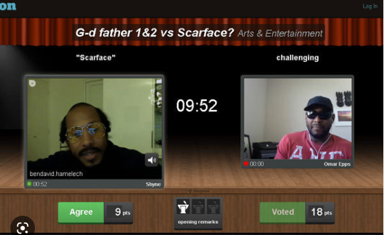
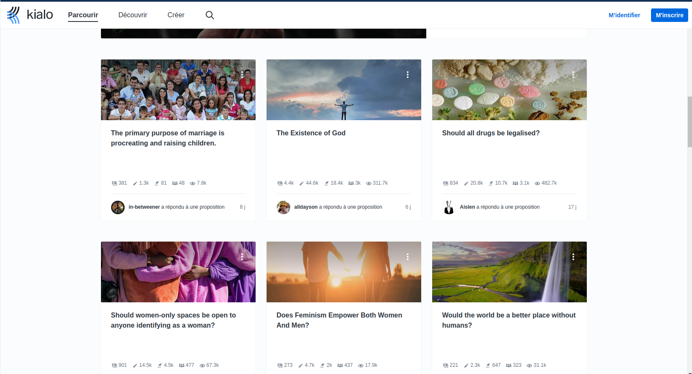
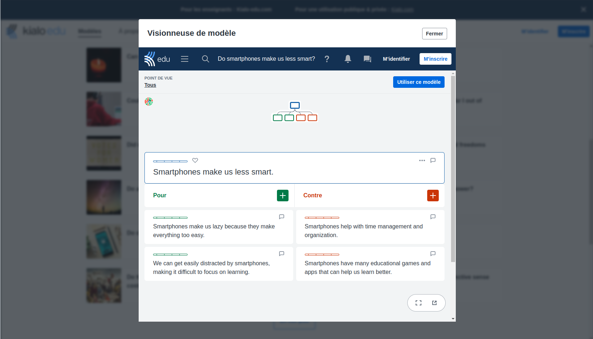
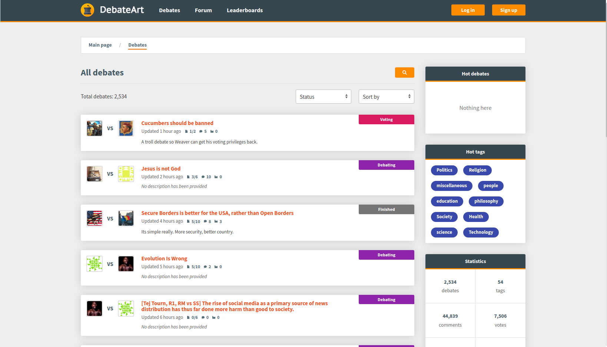
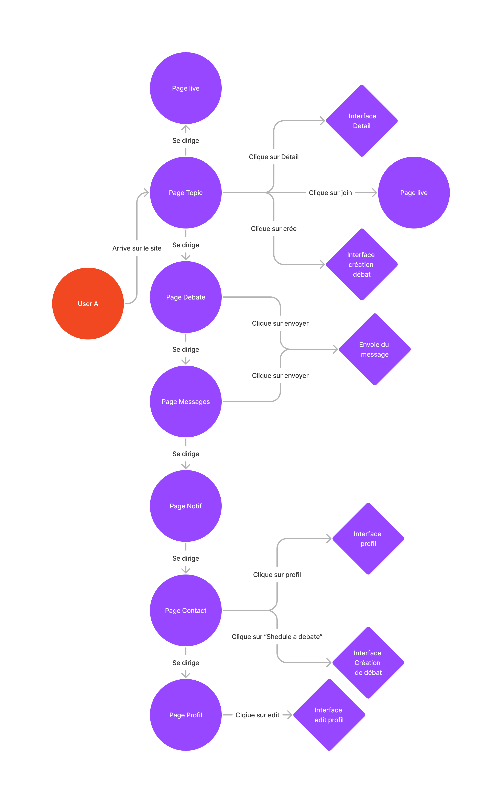
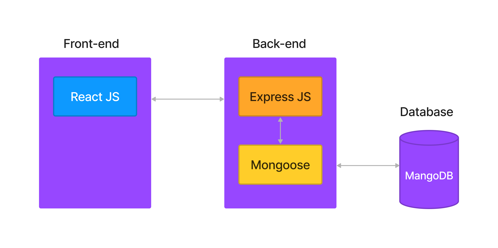
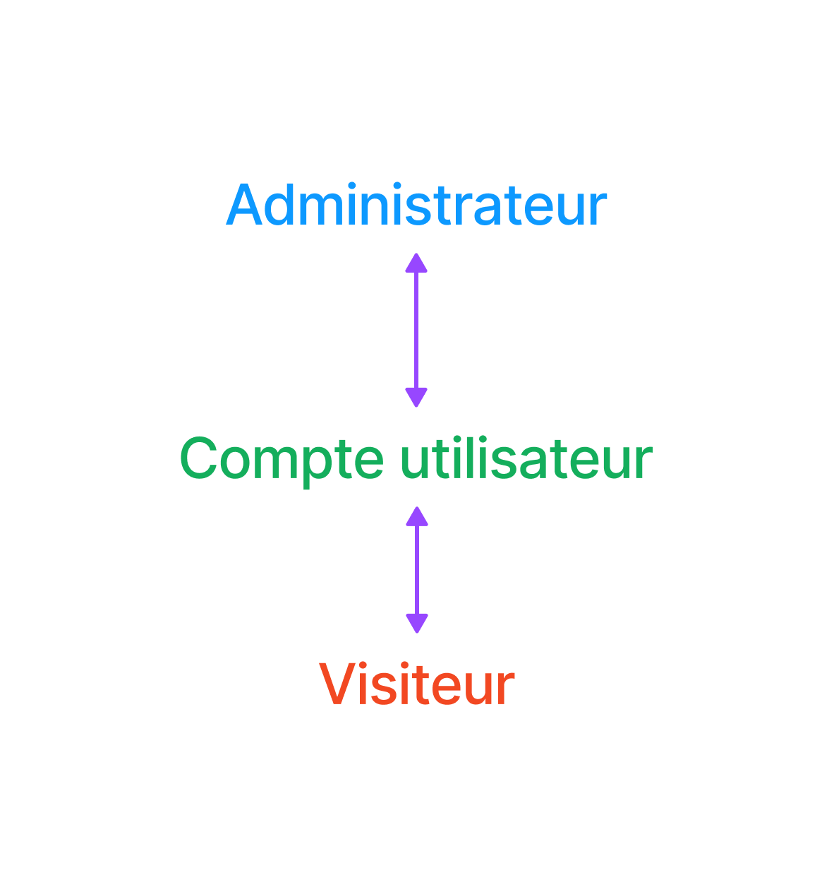

# DEBATE

## Résumé

Debate est une application web qui permettera a 2 deux personnes de communiquer entre eux. Ce projet n'est pas la partie compléte mais plutot une partie de l'application.

## Introduction

Etant un passioné de débat, a ma grande surprise je n'est pas trouvé de platforme en ligne qui permet de réaliser des débats en ligne en utilisant une camera et un micro. D'ou mon idée de faire un site qui propose au débatteur de tout niveau d'avoir un débat civilisé.

Depuis l'arrivé des réseaux sociaux, les gens donne leur avis et d'autre personne réponde. C'est techniquement un débat et donc les réseaux sociaux sont déja un bon moyen de débattre mais il y a un problème, les gens ne sont pas forcement civilisé et ne respecte pas les règles de base du débat. C'est pour cela que je souhaite créer une plateforme qui permet de réaliser des débat en ligne.

De plus, l'application web permetterai de pouvoir débattre sous forme de video.

## Analyse de l'existant

D'après mes recherche, il n'existe aucun site qui propose des débats vidéo en ligne. Il y avait à l'époque un site nommé 'deeyoon' qui proposait des débats video mais il n'est plus en ligne.
Il avait un look vraiment ancien et ne donnait pas envie d'y aller.

Le site permettait de créer des débats asser simple sans régle, juste avec un timer et un system de votation.
Il y a cependant plusieurs site qui propose des débat par écrit comme 'Kialo'.

Le site kialo propose un style de débat asser original, chaqun peut ajouter un argument pour ou contre le sujet du débat.

Il y a aussi des site qui propose des débat écrit comme 'DebateArt'.

## Environnement

### Matériel

Pour le matériel je dispose de :

- 3 écran HP
- Un ordinateur
- Un clavier
- Une souris
- Un micro
- Une webcam

### Logiciel

Pour le logiciel je dispose de :

### Visual Studio Code

Visual studio code est mon IDE favorie qui met a disposition de nombreuse extention qui me permettent de travailler plus efficacement.

## Planning

Voici le planning prévisionnel du projet qui à été réaliser avec Excel.

## Trello

Trello me permet de gérer mon projet en notant les différentes taches et leur status.

Mon trello comporte 3 colonnes:

- A faire
- En cours
- Terminé

## Journal de bord

Le journal de bord m'a permis de noté petit a petit les différentes taches que j'ai effectué, les problèmes que j'ai rencontré et les solutions que j'ai trouvé.

Voici un exemple de la structure de mon journal de bord :

### 28 Février 2023

** Objectif de la journée : ** Avancé la documentation et le projet

** 8H15: ** Je dois avancé la documentation car j'ai tout de meme pris un peu de retard

** 9H25: ** J'ai rencontréun probleme mais ...

** 10H55: ** ...

** 11H40: ** ...

** Bilan de la journée : ** J'ai avancé la documentation

## Analyse fonctionelle

Lorsque qu'on arrive sur le site on arrive sur la page principale qui présente les topics, on peut cliquer sur les topics pour avoir plus d'informations a leur propos.

Lorsque l'on clique sur le bouton "create" le forumlaire s'ouvre et on peut y créer un topic.

L'application est responsive, elle s'adapte a la taille de l'écran notamment sur les mobiles.

### Cas d'utilisation

L'application propose une navigation simple et intuitive. Il est assser facile pour n'importe qui de s'y retrouver.

### Structure du projet

L'application utilise la MERN stack (MongoDB, Express, React, Node.js).

Voici comment ces différente technologie communique entre elle.

### Droit d'accès

Il y a 3 types d'utilisateurs:

Chaque utilisateur a des droits d'accès différents.

Droit d'accès pour l'administrateur:

Droit d'accès pour les utilisateur inscrits:

Droit d'accès pour les utilisateurs non inscrits:

### Diagramme de classe

## Analyse organique

### mangoDB

J'ai une base de donnée mangoDB qui contient les topics, les utilisateurs et les messages.
Pour effectuer un CRUD sur les topics j'ai une API qui permet de faire les requetes.

## Github

Le githb du projet se trouve à l'adresse suivante [github](https://github.com/AlbadriR/PDA_Project)

## Structure de l'application

- client
  - public
  - src
    - components
    - Button
    - Contexts
    - Languages
    - Layout
    - Topics
  - pages
    App.js
    index.js

## Cheat Sheet de l'API

### Topics

#### GET

- /api/topics

  - Récupère tous les topics

- /api/topics/:id
  - Récupère un topic en fonction de son id

#### POST

- /api/topics
  - Créer un topic

#### PUT

- /api/topics/:id
  - Met à jour un topic en fonction de son id

#### DELETE

- /api/topics/:id
  - Supprime un topic en fonction de son id

## Tests

## Conclusion

## Glosaire

### Topics

Un topic c'est un sujet de discussion, il peut être ouvert par n'importe quel personne qui a un compte.
