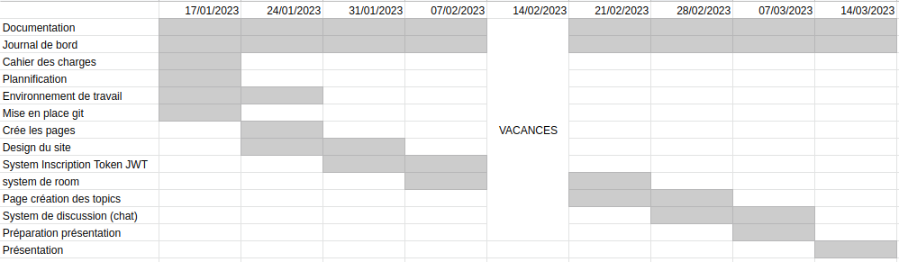
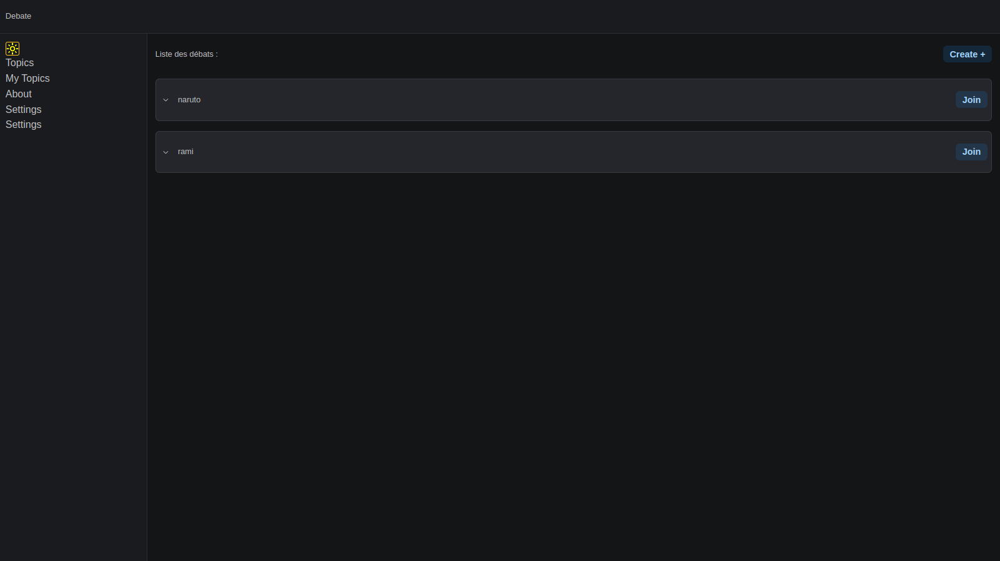
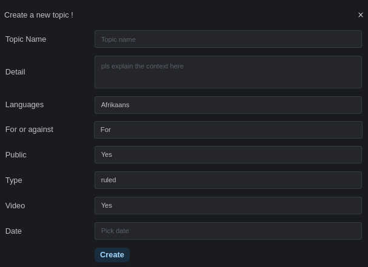
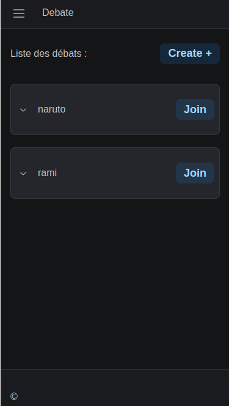

# DEBATE

## Introduction

Debate est une application web qui permettera a 2 deux personnes de communiquer entre eux. Ce projet n'est pas la partie compléte mais plutot une partie de l'application.

## Planning

## Analyse fonctionelle

Lorsque qu'on arrive sur le site on arrive sur la page principale qui présente les topics, on peut cliquer sur les topics pour avoir plus d'informations a leur propos.

Lorsque l'on clique sur le bouton "create" le forumlaire s'ouvre et on peut y créer un topic.

L'application est responsive, elle s'adapte a la taille de l'écran notamment sur les mobiles.

## Analyse organique

J'ai une base de donnée mangoDB qui contient les topics, les utilisateurs et les messages.
Pour effectuer un CRUD sur les topics j'ai une API qui permet de faire les requetes.

## Organigramme

## Github

Le githb du projet se trouve à l'adresse suivante [github](https://github.com/AlbadriR/PDA_Project)

## Tests

## Conclusion

## Glosaire

### Topics

Un topic c'est un sujet de discussion, il peut être ouvert par n'importe quel personne qui a un compte.
